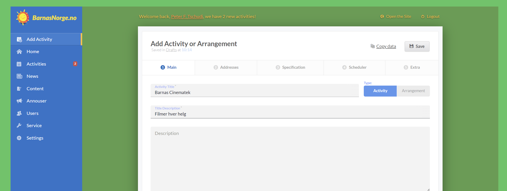

# ABC Tokens
POI Aggregator - Admin Panel

## Demo
http://axure.stage.sharp-dev.net/poi-aggregator_admin/

## Technologies

## Assembly automation

## Project features
- Responsive adaptive design up to 320px
- Using Nunjucks template engine from Mozilla

